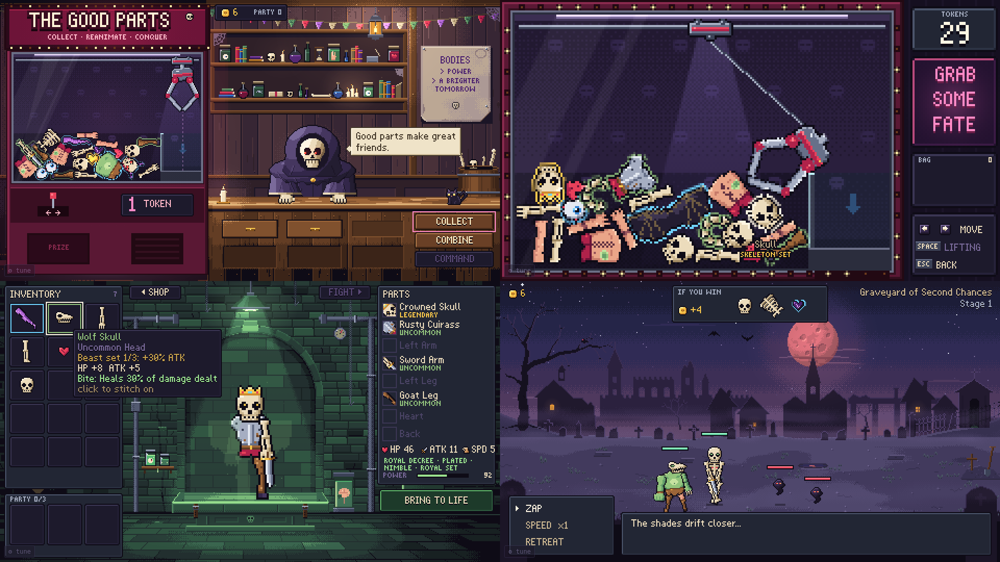

# THE GOOD PARTS

**Collect · Reanimate · Conquer.** A claw-machine necromancer prototype that runs in the browser.

A hooded Reaper runs a claw machine full of body parts. Grab parts with a physics claw, stitch them into mismatched monsters on the slab, and send them to fight the shades in the graveyard. Winning earns more tokens, and the graveyard restocks the machine. Creatures that die go back into the pile with their names attached. Matching parts (three skeleton bits, a full royal set) give a creature a bonus, which is a reason to chase one particular part.



## Play

- **Easiest:** open `index.html`. It's a single self-contained file (about 700 KB) that works offline with no server.
- **Development:** open `dev.html`. It loads `src/js/*.js` directly, so you can edit and refresh.

Controls:

- **Claw:** ← → move, Space to drop, steer to the chute, Space to release, Esc to go back.
- **Everything else:** mouse (touch works too). Gamepad works on the claw.
- **Shortcuts:** M to mute, ` for the tuning panel, P for the playtest report.
- **Battle:** SPEED x1/x2 in the menu. The panel at the top shows what winning pays.

## What this prototype is testing

Is the claw grab fun enough to be the core of a monster-building game? [PROTOTYPE.md](PROTOTYPE.md) covers:

- the exact question and the scope
- how to playtest it (what to watch for, plus a log template)
- what the automated tuning found
- what to do if the answer is yes, or no

## Build and tools

```sh
npm install                     # dev tools only: playwright-core for play.mjs/shot.mjs (the sims fall back to the vendored planck)
node tools/build.mjs            # -> index.html + dev.html
node tools/tune.mjs 300         # headless claw bot: grab/slip odds per part
node tools/battle_sim.mjs 60    # headless battle balance per stage
DSF=2 node tools/play.mjs "dev.html?scene=claw" out '[{"hold":"ArrowLeft","ms":800},{"press":"Space"},{"wait":6000},{"clip":[0,0,480,270],"shot":"grab"}]'   # clip crops in game pixels; DSF sharpens
```

## Credits

- Game code, pixel art, bitmap font, synthesized audio and music were all made for this prototype.
- Physics is [planck.js](https://github.com/piqnt/planck.js) v1.5.0 (MIT, © Erin Catto and Ali Shakiba). It's vendored in `vendor/`, with its license alongside.
- Art direction follows the concept board the prototype was built from.
