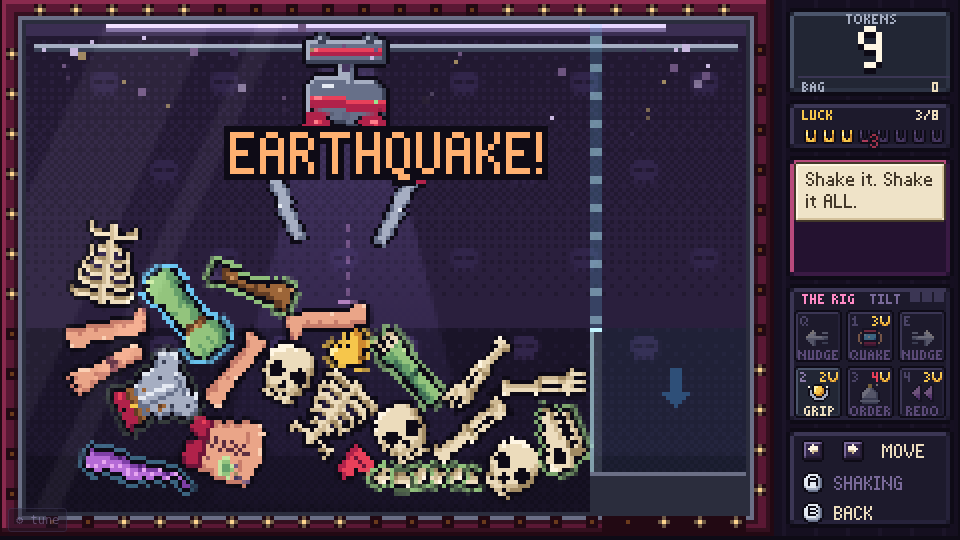

# THE GOOD PARTS

**Collect · Reanimate · Conquer.** A claw-machine necromancer game that runs in the browser.

> Every monster you send to fight is built from parts you won from the claw, and every part it loses goes back in the machine.

A hooded Reaper runs a claw machine full of body parts. Grab parts with a physics claw, stitch them into mismatched monsters on the slab, and send them to fight the shades in the graveyard. Winning earns tokens and restocks the machine; creatures that die fall apart back into the pile. Fifteen stages, three acts, a boss at every fifth. The last one is the Landlord.


## Play

- **Easiest:** open `index.html`. One self-contained file (about 760 KB) that works offline with no server. Your run is saved in the browser and comes back after a refresh.
- **Development:** open `dev.html`. It loads `src/js/*.js` directly (edit, refresh) and has the tuning panel and cheats. The page players get has neither.

Default controls (every key can be rebound in Settings; `P` opens the pause menu):

| | |
|---|---|
| **Claw** | `←` `→` steer · `Space` drop, and again to let go over the chute · `Esc` back. Holding the mouse or a finger on the glass steers toward it. |
| **Carrying** | Hold a direction to speed up, ease off to steady it. **Fast carries sway, and a swinging part slips.** The meter shows it. |
| **The Rig** | `Q` `E` nudge the glass · `1` quake · `2` iron grip · `3` order · `4` redo, or click the panel beside the glass. Gamepad: LB / RB nudge, X quake, Y iron grip. |
| **Slab** | Click a part to stitch it on, click a slot to take it off, or use the arrow keys and `Space`. **BRING TO LIFE** when ready. |
| **Graveyard** | **FIGHT**, then **ZAP** (heal and haste, on a cooldown) or **RETREAT** (keeps everyone standing, pays for the damage you did). |
| **Anywhere** | `P` pause · `M` mute · `F` fullscreen. Mouse and touch are wired up everywhere (touch has only been simulated, not tried on a real device: see docs/RELEASE.md). The **Menu** button under the game pauses. |

Pausing stops everything and allows no game action. That is deliberate: a fight you can plan frame by frame is not a fight.

## The Rig: rig the machine back



The claw is a luck machine, and the Reaper admits it's rigged. So the machine now has a panel of switches on the side. Bad luck fills your **LUCK** meter (a miss is +1, a slip is +2, a battle won is +1), and Luck buys levers that bend the odds:

| Lever | Key | Cost | What it does |
|---|---|---|---|
| **Quake** | 1 | 3 | An earthquake. The pile churns into a new layout. |
| **Nudge ◀ ▶** | Q E | free | Bump the glass. Do it too fast and the machine **TILT**s. |
| **Iron Grip** | 2 | 2 | The next drop holds harder and slips far less. |
| **Order** | 3 | 4 | Pick a slot; the Reaper drops one in from the back room. |
| **Redo** | 4 | 3 | After a miss or slip, turn back time: same pile, token back, fresh dice. |

A **Lens** shows the odds: a badge on the drop guide before you drop, and the actual roll when the claw closes. In `dev.html`, `?rig=0` gives the original claw, to compare. The full plan, numbers and safety rails are in [docs/RNG_LAYER.md](docs/RNG_LAYER.md).

## The docs

| File | What it is |
|---|---|
| [docs/DESIGN.md](docs/DESIGN.md) | The promise and the pillars, worded to settle arguments, with the check that keeps each true |
| [docs/RNG_LAYER.md](docs/RNG_LAYER.md) | The Rig: the claw's luck levers, their numbers and their safety rails |
| [docs/BALANCE.md](docs/BALANCE.md) | Every balance number, the evidence for it, and the targets it must meet (generated by `tools/balance.mjs`) |
| [docs/ACCESSIBILITY.md](docs/ACCESSIBILITY.md) | What is in, how it is checked, and what is not covered |
| [docs/RELEASE.md](docs/RELEASE.md) | Shipping, saves across updates, and what has **not** been tested on real hardware |
| [CHANGELOG.md](CHANGELOG.md) | What changed, for players |
| [PROTOTYPE.md](PROTOTYPE.md) | The original prototype notes and playtest guide. Historical: several details there are superseded |

## Build and test

```sh
npm install             # dev tools only: planck (a vendored copy is in vendor/) and playwright-core
npm run build           # index.html, dev.html, dist/ (including the itch.io zip)
npm test                # rules, saves, keys, fixed-seed fights and grabs, the flashing lint
npm run balance:check   # do the numbers still match the evidence, and are the targets met?
npm run e2e             # real Chromium: pause, rebind, continue, victory, crashes, frames, a soak
npm run verify          # all of the above
npm run rigcheck       # the Rig, headless: quake, rewind, economy, fuzz
```

| Tool | For |
|---|---|
| `tools/test.mjs` | Regression tests. `--update` rewrites `tools/golden.json` (the diff in git is the record of what a rebalance moved) |
| `tools/balance.mjs` | Measure everything, rewrite `docs/BALANCE.md`. `--quick` skips real physics; `--check` is CI |
| `tools/run_sim.mjs` | Whole runs played by bots (careful, average, masher, assisted) with real physics or the fast model (`--fast`) |
| `tools/tune.mjs` | The claw tuner: grab odds by carry style, sweeps of any CONFIG value |
| `tools/rig_check.mjs` | The Rig, headless: quakes, nudges, the chute lid, rewind, the Luck economy, a fuzz |
| `tools/matchups.mjs` | Which build beats which enemy |
| `tools/battle_sim.mjs` | Win rate of party shapes by stage |
| `tools/e2e.mjs` | The browser suite |
| `tools/play.mjs`, `tools/shot.mjs` | Scripted play and screenshots of `dev.html` |

## Credits

- Game code, pixel art, bitmap font, synthesized audio and music were all made for this game.
- Physics is [planck.js](https://github.com/piqnt/planck.js) v1.5.0 (MIT, © Erin Catto and Ali Shakiba). It is vendored in `vendor/`, with its license alongside.
- Art direction follows the concept board the prototype was built from.
