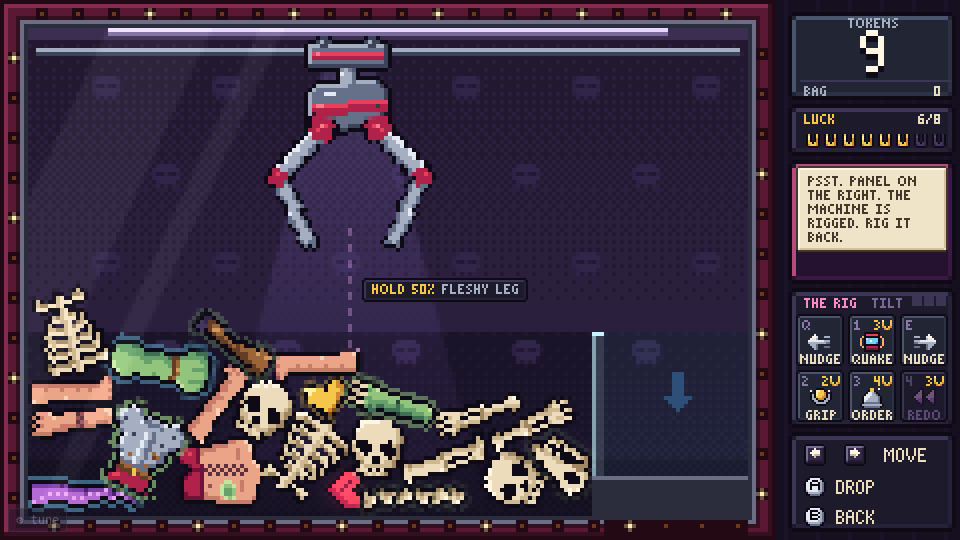
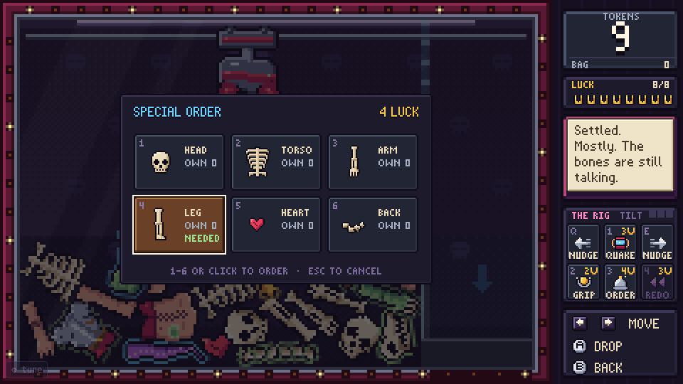

# The Rig: the RNG manipulation layer

> The machine is rigged. So rig it back.

A luck-based game stays fun only while the player feels they can *push* the luck, not merely suffer it. The claw is the purest luck machine there is, so it gets the full treatment: one new resource (**Luck**), five levers that bend the odds in five different ways, and a **Lens** that shows the odds being bent.

This page is the plan: what was built, why, how it is wired in, what keeps it honest, and what still needs a human at the machine.

---

## 1. The problem

[PROTOTYPE.md](../PROTOTYPE.md) §8 names the kill signal for the claw: *"Slips feel unfair rather than dramatic ('it's rigged')."* Its own tests found that aim decides **which** part you get but almost nothing decides **whether** you get one, and that carrying is not yet a skill.

A pure-luck loop has three weaknesses:

| Weakness | What the player feels |
|---|---|
| No information | "Was that a good grab or a bad one? Was it rigged?" |
| No agency over the dice | "I can only pay and hope." |
| Bad luck is wasted | "I missed three times. Nothing came of it." |

The layer fixes each one without removing the randomness. It gives luck a **price**, a **memory** and a **steering wheel**.

> **Since 0.11** the claw is a real claw: the grab rolls nothing, and on a plain drop nothing holds a part but the prongs. The luck left in the claw is the pile (what lies where, what is on top, what the machine holds), the living parts that twitch, and your own hands on the carry. The levers below bend exactly those. The Lens became a forecast of the physics instead of a peek at the dice, and Iron Grip is the one place where magic touches the grab.

## 2. Design principles

1. **Every source of luck in the claw loop gets a lever.** Layout, composition, grip, slip, and the final outcome.
2. **Information before manipulation.** You cannot bend odds you cannot see, so the Lens shows them.
3. **Cost or risk on every lever.** A free lever must be able to bite back (TILT). A safe lever must cost Luck.
4. **Bad luck is the fuel.** Misses and slips fill the Luck meter. Being unlucky builds the means to fight back, which is also soft pity.
5. **Bend, don't break.** No lever guarantees a prize. The best one still leaves you to aim and carry.
6. **Every lever is physical and visible.** Nothing is a hidden modifier. You can watch the pile move, the claw glow, time run backwards.
7. **No free-part exploits.** Nothing the layer does can put a part in the chute for free (see §6).

## 3. Fiction

The Reaper is the manager, and the claw is rigged (he has said so). Behind the machine is a maintenance panel he "forgot" to lock: **THE RIG**. Six switches. The currency is **LUCK**, drawn as horseshoes: the Reaper banks your misfortune and pays it back as favours.

Tone stays dry and morbid. "Bad luck is still luck. I'll bank it."



*Idle: the Luck meter (top right), THE RIG (bottom right) and the odds badge on the drop guide.*


*Quake: the pile churns, the chute is sealed by a wall of light, the levers lock until it settles.*



*Order: pick a slot. The menu shows how many you own and marks the one you are short of.*

## 4. The economy: Luck

| | |
|---|---|
| Symbol | Gold horseshoe, 8 pips |
| Start | 3 (enough for one Quake, so curiosity is rewarded at once) |
| Cap | 8 (extra is lost, and the Reaper nags you to spend it) |

**Sources**

| Event | Luck |
|---|---|
| A grab that **misses** (nothing ever lifted) | +1 |
| A grab that **slips** (you had it, then lost it) | +2 |
| A battle won | +1 |
| A battle lost (consolation) | +1 |
| A grab that wins | 0 (you did not need it) |

**Sinks**

| Lever | Cost |
|---|---|
| Quake | 3 |
| Iron Grip | 3 |
| Order | 4 |
| Redo | 3 |
| Nudge | free, but TILT risk |

**Sanity check.** A bot grabs with about 38% misses and 4–12% slips, so a grab earns about 0.5–0.6 Luck on average. That is roughly one lever use for every 5 or 6 grabs, plus one per battle. Converting tokens into Luck on purpose (throwing grabs) is a losing trade: a thrown grab earns 1–2 Luck, and 3 Luck buys an Iron Grip, a single hexed drop.

## 5. The levers

Six cells in a 3×2 grid under the Reaper's speech box. Row one is the physical shakes (nudge · quake · nudge). Row two is the claw and the meta (grip · order · redo).

### 5.1 QUAKE — shuffle the machine &nbsp;`[1]` &nbsp;3 Luck

An earthquake. The cabinet shakes, dust falls from the ceiling, the pile churns and lands in a new arrangement.

- **What it re-rolls:** *layout.* Buried parts surface, top parts sink, parts jammed in the corner come loose.
- **Physics:** for about 1.8 s the sim applies a shaped series of velocity shocks to every part: an opening P-wave (a big upward jolt), a rumble of coherent side-to-side slosh every 55-95 ms, a strong vertical bump about every 0.4 s, and an aftershock. These are velocity changes, not forces, so heavy parts and light parts are shaken alike, as in a real quake. Each shock is *coherent* (one strength for the whole pile plus a little per-part variation): giving every part its own random strength made stacked parts collide in mid-air and sling the top one far too high. Parts are damped while shaking and steadied when it stops, and speeds are clamped.
- **Risk:** it is variance. It can bury the legendary you were eyeing as easily as expose it. Drops stay locked until the pile is at rest: at least 0.5 s and at most 2.4 s after the shaking stops.
- **Limits:** only from idle. The chute is sealed (§6).

### 5.2 NUDGE ◀ ▶ — bump the glass &nbsp;`[Q]` `[E]` &nbsp;free

The classic arcade trick, and the pinball one. A sideways bump with a little hop, strongest around the claw's x and weaker at the far ends.

- **What it re-rolls:** *layout, locally.* Loosens a wedged stack, slides the pile away from the wall, tips a mound.
- **Physics:** a velocity kick (about 185 px/s sideways and 100 px/s up at full strength, each varied per part) with falloff from the claw, a little random spin per part. Average shift: about 14 px one way, hardest within 30 px of the claw.
- **Risk:** TILT. Each nudge adds heat; heat drains at 0.45/s. Go past 3 and the next nudge trips **TILT**: the machine jolts, the claw locks for about 3 s, and you lose 1 Luck. The gauge in the panel header shows the heat. Three quick nudges are safe; a fourth is not.
- **Limits:** only from idle. Seals the chute like a quake does (§6). Free, so it cannot produce parts.

### 5.3 IRON GRIP — hex the claw &nbsp;`[2]` &nbsp;3 Luck

Arms the **next drop** with necromancy, the only magic the claw ever gets. Press again before dropping to disarm and get the Luck back.

- **What it bends:** *reach, grip and slip.* A plain drop is the claw's own physics. A hexed one gets:
  - the **soul hook**, which drags the part straight under the claw up into its mouth while it spreads and clamps (`hookPull`, `hookReach`), so even a part in a pit can be reached;
  - the **soul grip**, which binds what the claw catches to its heart with a friction joint as strong as the catch is good, 1.6x (`gripStrength`, `ironBoost`), and binds catches half as good as a plain claw needs (`ironCatch`);
  - a rough carry strains it about a third as much (`ironSlip` 0.35).
- **Measured.** The claw bot, aimed at parts a player would pick (200 drops each): a careful carry wins 39% plain and 86% hexed, a mashed carry 30% and 81%. `tools/rig_check.mjs` (the same seeded drops at any part, with and without it): 19% → 83%.
- **Does not** fix your aim, and does not stop a part that is physically wedged in the pile from tearing free. It turns "it had it, then dropped it" into a rare event, not into a certainty.
- **Feedback:** gold aura and status light on the claw; the drop guide and the part under it turn violet (the soul hook will reach for it); the Lens shows the boosted odds before you drop.
- **With Redo:** if the armed drop fails and you Redo it, the Iron Grip is armed again. The rewind puts the world back exactly as it was before the drop, and the Luck for the grip was already spent.

### 5.4 ORDER — special order &nbsp;`[3]` &nbsp;4 Luck

Opens a small menu of the six slots (head, torso, arm, leg, heart, back) with how many of each you own. Pick one and the Reaper drops a part of that slot in from the back room.

- **What it re-rolls:** *composition.* Rarity is still rolled normally (with the usual stage boost) and the part lands at a random spot, so you still have to grab it.
- **Why it matters:** the creature builder punishes missing slots. "I have four arms and no torso" becomes a solvable problem.

### 5.5 REDO — turn back time &nbsp;`[4]` &nbsp;3 Luck

After a **missed or slipped** grab, rewinds the world to the moment before the drop and refunds the token. The last few seconds play backwards: parts slide home, the claw climbs back, the pile is exactly as you left it, and you get another go.

- **What it re-rolls:** *the outcome.* Same pile, same claw position, token back. Nothing about the grab is rolled, so the same drop does much the same thing (only the living parts' twitches differ): move your aim, arm Iron Grip, or carry more gently this time.
- **Physics:** the sim records every part and the claw about 30 times a second during a turn. Rewinding replays those frames in reverse by setting body transforms directly, with no physics stepping, so it is exact. Angles are restored *raw*: planck's `setTransform()` wraps a body's angle into (-π, π], but a revolute joint measures its angle from the raw difference of its two bodies, so a wrapped restore left a bone tail that lay across the ±π seam with its joints off by 2π and the limit solver thrashing it. (Found in review and reproduced; `tools/rig_check.mjs` forces that case.)
- **Limits:** one rewind per failed grab. It is lost the moment anything changes the world (a new drop, a quake, a nudge, an order, a restock) or a part fell out of the machine. The Luck you earned from the failure is kept, so a failure can pay for its own undo.

### 5.6 LENS — see the odds &nbsp;(always on)

Not a lever: the information layer.

- **Before you drop:** a badge on the drop guide reads `HOLD 58%  SKULL`: the chance this drop comes up holding *something*, and the part under the claw. Green from 52%, yellow from 33%, red below. Armed Iron Grip shows in the number.
- **After the claw closes:** what the claw really caught and how firmly (`WOLF SKULL  GRIP 76%`, `NO GRIP: BY THE TIPS` or `NOTHING IN THE CLAW`). Nothing is rolled, so this is a reading, not a roll: the catch quality is the hold that the carry meter then measures your handling against.

The badge is a forecast of the physics (`ClawSim.chanceFor`). On the claw's own physics the thing that matters most is whether the part under the claw lies on top of the pile or down in a pit between taller neighbours, where the prong tips can't get under it. `predict()` measures that by casting rays 10 and 14 px to either side: on top, 63% of drops held something; deep in a pit, 21%. Size (a big torso barely fits the mouth), how far off-centre and slime come next. Iron Grip leaves only `lensIron` (0.22) of the plain chance to fail. The calibration matters: a badge that over-promises feels rigged, which is the opposite of the point (the first, uncalibrated badge on the dice grab showed a green 79% that held 59% of the time). Fitted to 400 drops each: badge 40.8% vs held 41.0% plain (red badges held 25%, yellow 43%, green 60%), 87% vs 89% with Iron Grip. `tools/rig_check.mjs` guards it (badge 40% vs held 43% over 240 drops; green 71% vs yellow 44%) and checks that the grab rolls no dice. If the grab changes (the prongs, the spread, `ClawSim.scanCage`, the soul hook), re-measure `lensShift` and `lensIron`.

## 6. Keeping it honest

| Risk | Rail |
|---|---|
| Shaking parts over the chute guard for free parts | **Chute seal.** From the first shake or nudge, an invisible wall (collides with parts only, the claw ignores it) runs from the top of the guard to the glass ceiling. Shaken parts bounce off it. It stays up through the whole drop, close and lift, and comes down when the claw starts carrying (a held part then has to cross the guard, as always), or when the turn ends. It has to last that long: an earlier version dropped it a few seconds after the shaking, and a shaken mound occasionally toppled into the chute later; a later one dropped it the instant the claw started down, so a part still in flight from a nudge could land in the chute during the drop. Measured: without the seal 8 of 40 quakes spilled a part, and a part thrown at the chute mid-drop got in 29 times out of 30; with it, never. |
| Farming Luck by throwing grabs | Converting tokens to Luck is a losing trade (§4). |
| Infinite free retries | Redo costs 3 Luck and Luck only comes from failures and battles; a redo consumes the benefit of about 2–3 failures. |
| Luck hoarding | Cap of 8. |
| Spamming the free lever | TILT: heat, lockout, Luck penalty. |
| Unsafe state after a rewind | Redo is invalidated by anything that changes the world. Any part removed or added since the drop cancels it. The restore is exact, raw angles and joint angles included (§5.5). |
| Changing the tuned claw | The layer adds hooks, not rolls. With no lever used, the claw's physics are unchanged (`tools/rig_check.mjs`: identical results with the turn recorder stubbed out), and the grab itself rolls no dice (another random stream from the moment of the drop gives the very same catch). |

## 7. Architecture and integration

```
src/js/
  01_config.js    + "Rig" group of tunables (all costs, powers, economy)
  08_audio.js     + quake, nudge, tilt, luck_gain, luck_spend, grip_arm, order, rewind, roll_ok, roll_no
  06_sprites_world.js  + icons: luck pip (full/empty/mini), quake, nudge L/R, grip, order bell, redo
  11_clawsim.js   hooks only: drop lock, turn recording, Iron Grip in scanGrips / setGripStrength /
                  soulHook / the carry strain, 'rewind' state
  12_clawrig.js   ClawSim mixin: quake, nudge, chute seal, lock, chanceFor + predict (lens), record + rewind
  20_engine.js    + input actions (Q/E, 1-4, pad X/Y/LB/RB)
  src/artifact.html + the new keys in the hint line
  29_rig.js       Rig: Luck, costs, heat/TILT, can()/use(), redo offer, economy hooks, telemetry
  30_game.js      newGame() resets Rig
  31_scene_claw.js  side column re-laid-out; RIG panel, Luck meter, Lens, popups, FX, order menu
  34_scene_battle.js  + Luck on victory/defeat
  35_scene_shop.js    + Luck in the HUD, a hint from the Reaper
  40_telemetry.js + lever use, Luck flow, rigged-vs-unrigged win rates
  41_debug.js     + cheats (luck, free levers, quake now)
  99_main.js      ?luck=N  ?rig=0 (layer off, for A/B playtests)
tools/rig_check.mjs   headless verification of the above
```

**Event flow.** The scene asks `Rig.use(name)`. `Rig` checks the rules, spends Luck, calls the sim (`sim.quake()`, `sim.nudge()`, ...), logs telemetry, and emits `'used'`. The sim emits physical events (`quake`, `quakePulse`, `nudge`, `seal`, `bind`, `slipping`, `rewind`, ...). The scene turns those into sound, shake, particles and Reaper lines. Rules live in `Rig`, physics in the sim, presentation in the scene, so each can be tested alone.

**Headless-safe.** `12_clawrig.js` has no DOM. `tools/tune.mjs` and `tools/battle_sim.mjs` load it.

## 8. The side column

The right column (84 px wide) was full, so it was re-budgeted in screen pixels:

| Panel | y | h |
|---|---|---|
| Tokens + bag | 6 | 44 |
| Luck | 52 | 26 |
| Reaper speech / neon sign | 80 | 62 |
| THE RIG | 144 | 70 |
| Controls (move, drop, back) | 216 | 50 |

The Reaper's face is gone from this scene (the bubble uses the whole box); the bag folds into the tokens panel.

## 9. Controls

| | Keyboard | Gamepad | Mouse / touch |
|---|---|---|---|
| Nudge ◀ ▶ | `Q` `E` | LB RB | cells in THE RIG |
| Quake | `1` | X | cell |
| Iron Grip | `2` | Y | cell |
| Order | `3` | — | cell, then pick a slot (`1`–`6`, arrows + drop, or click) |
| Redo | `4` | — | cell |

Hover a cell for its name, cost and effect.

## 10. Tuning

Every number is in the **Rig** group of the tuning panel (`` ` ``): costs, Luck income and cap, quake length and power, nudge power and radius, TILT threshold and lockout, Iron Grip strength, and a "free levers" cheat. **Copy values** exports your changes. `?rig=0` turns the layer off entirely, for A/B playtests against the original claw.

## 11. Verification (no human play involved)

`node tools/rig_check.mjs` runs the real sim headless and checks:

- **Quake quality:** average part displacement (about 18 px), how many parts change what sits on top of them (about 58%), how high parts heave (average 24 px, worst about 46 px), and when the drop unlocks (about 3.0 s after the quake starts).
- **Quake safety:** no part lost, no part won, no NaN, claw intact, across many seeds.
- **Chute seal:** with the seal, zero spills; without it, spills do occur (14 in 40 quakes), so the seal is doing real work. The lid stays up through the drop, close and lift, is down while the claw carries and when the turn is over (also when the claw comes up empty and lets go at once), and a part thrown at the chute mid-drop never gets in (40 of 40 do without the lid).
- **Nudge:** shoves the right way (about 10-13 px), hardest near the claw, no spills, no NaN.
- **Redo:** after a failed grab, every part and the claw are restored to the recorded pre-drop state, exactly: positions, raw angles (no modulo 2π; comparing modulo hid a real bug), every revolute joint angle, the joint count. A bone tail is forced to lie across the ±π seam, and the same check is shown to fail (joint error 2π) with the old wrapped restore. Iron Grip comes back with the rewind, and only when it was armed.
- **Iron Grip:** win rate 19% → 83% on the same seeded drops, and fewer grabs that lose what they caught on the way.
- **Lens:** the badge equals the Lens model times the measured shift, Iron Grip always raises it, the grab rolls no dice (a different random stream from the moment of the drop gives the very same catch), and the badge is calibrated (40% shown vs 43% actually held over 240 drops) and discriminates (green badges held 71%, yellow 44%).
- **Economy and rules:** Luck gains, cap, spending, refunds (also in the stats: a taken-back Iron Grip is not counted as spent), costs, TILT (the fourth quick nudge), Order delivery by slot, `rigOn=0`, `rigFree=1`.
- **Hooks are invisible:** the same seeded grabs with the recording hooks stubbed out give identical results. And `VERBOSE=1 node tools/tune.mjs 80` before and after the layer was added produced bit-identical results for all 80 seeds.
- **Fuzz:** hundreds of random lever pulls, drops, releases and steps keep every invariant.

Also checked outside the harness: every new sound effect rendered offline through the real mixer (audible, no NaN, no clipping, loudness in line with the existing sounds), sprite rows and palette keys (`tools/check_sprites.cjs`), and a scripted headless browser run that loads the page and pulls every lever with real key presses, watching for script errors. That last one is a smoke test, not a playtest: nobody has judged how any of it *feels*.

## 12. What a human still has to answer

The layer is tuned by reasoning and measurement, not by feel. Watch for:

- **Do they reach for it?** Does the first-time player find the Luck meter and try a lever within a few grabs?
- **Does Redo kill the tension?** The token cost is what makes "one more try" matter. If players Redo every miss, raise its cost or make the refund partial.
- **Does Quake feel like a reroll or like a chore?** Watch for players who quake, then immediately quake again. Consider a short cooldown.
- **Is TILT fair?** It should feel like a warning, not a trap. Raise the threshold if players trip it by surprise.
- **Does the Lens change behaviour?** Do they aim at the green-badged part, or ignore the badges?
- **A/B:** run the same tester with `?rig=0` and compare the report's one-more-try rate and grabs per session.

**Kill signals.** Testers ignore the Luck meter entirely; Redo is used on nearly every failed grab; the levers make the claw feel *solved* rather than more expressive.

## 13. Backlog (not built)

- **MAGNET**: pull metal parts (crown skull, gold heart, cuirass, sword arm) toward the claw.
- **LEVITATE**: a few seconds of low gravity. A gentler, floatier shuffle.
- **HOLD**: pin a part so a Quake cannot move it (the slot-machine "hold").
- **SCRY**: show the next restock before it falls.
- Set bonuses and meta-progression for levers (unlock, upgrade), per PROTOTYPE.md §8.
